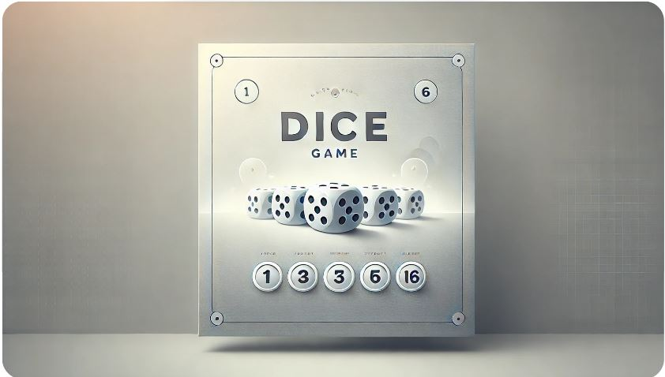

# 🎲 DadosGame 🎲



¡Bienvenido a **DadosGame**! Un juego sencillo y divertido donde puedes probar tu suerte lanzando los dados. 🕹️

## 📖 Descripción

DadosGame es un proyecto de juego en JavaScript que permite lanzar dados al azar y presenta un límite de una partida por día para cada jugador, ¡asegurando que cada sesión sea especial! 🌟

## 📁 Estructura del Proyecto

Este proyecto contiene los siguientes archivos:

- **index.html**: 📄 Estructura HTML del juego.
- **style.css**: 🎨 Estilos aplicados para dar una apariencia limpia y moderna.
- **script.js**: 🔧 Lógica del juego, incluyendo la aleatorización del lanzamiento de dados y la limitación de una partida diaria.
- **img**: 📂 Carpeta con imágenes de los diferentes valores del dado (del 1 al 6) para mostrar el resultado de cada tirada.

## 🛠️ Requisitos

Para ejecutar el juego, solo necesitas un navegador web compatible con HTML, CSS y JavaScript.

## 🎮 Cómo Jugar

1. Abre el archivo `index.html` en tu navegador.
2. El juego cargará con un contador que inicia la partida. ⏳
3. Al finalizar el contador, el juego mostrará un número aleatorio del dado, del 1 al 6. 🎲
4. **Restricción**: Solo se permite una partida por día. Si intentas jugar de nuevo en el mismo día, recibirás una alerta. 🚫

## 🎨 Personalización

Si deseas personalizar la apariencia del juego:
- Modifica los colores y estilos en `style.css`. 🌈
- Cambia la lógica del juego o agrega nuevas funciones en `script.js`. 🛠️

## 🖼️ Captura de Pantalla

> [!IMPORTANT]\
> Este juego ha sido creado para utilizarse como juego para una web de compras u otro tipo de cosas, es por ello que solo puedes jugar una vez al dia.
> Si lo quieres tener para poder jugar las veces que quieras tienes que quitar este bloque de codigo:

```bash
const lastPlayedGame1 = localStorage.getItem('lastPlayedDateGame1');
    const currentDate = new Date().toDateString();

    if (lastPlayedGame1 === currentDate) {
        alert("¡Ya has jugado hoy! Vuelve mañana para seguir divirtiéndote.");
        return;
    } else {
        localStorage.setItem('lastPlayedDateGame1', currentDate);
    }
````

¡Diviértete lanzando los dados y disfruta de DadosGame! 🎲👾
